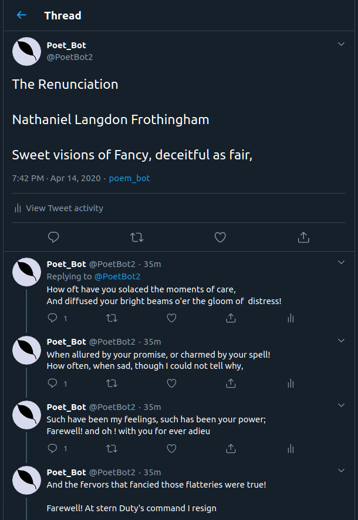

# POET_BOT 
A twitter bot that automatically scrapes poems and uploads on twitter .

## Setup and Authentication
* Clone the repo and setup the requirements 
* Create a twitter devloper account and get the API key,consumer secret, access token , access token secret
* Create a client_secret.json in the poet_bot directory and put the above data in the json file or just put the data directly in tweet.py 
* Run python3 tweet.py 

## Screenshots

